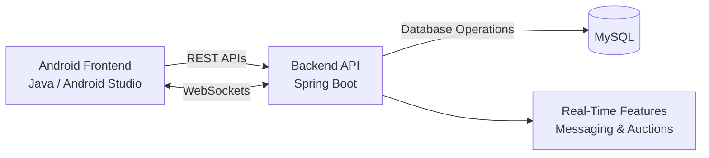

# TA4_5

# CyMarket
CyMarket is a student-focused marketplace application designed to make buying and selling within a college community easier. Instead of relying on general-purpose marketplaces, CyMarket provides students with a dedicated platform to discover, list, and exchange items within their university community.

## Overview
CyMarket was developed as a collaborative software engineering project with an Android frontend and backend services supporting marketplace functionality.

The application allows students to:
* Create and manage marketplace listings
* Browse and search for available items
* View item details and images
* Manage user profiles
* Communicate with other users
* Participate in marketplace auctions
* Buy and sell items within a student-focused community

The project focused on building a complete mobile marketplace experience while providing hands-on experience with frontend development, API integration, and collaborative software engineering.

## Features

### Marketplace
* Browse marketplace listings
* Search for items
* View detailed listing information
* Display images associated with listings
* Create and manage marketplace posts

### User Profiles
* View and manage user profiles
* Display user information and marketplace activity

### Messaging
* Support for communication between users
* Real-time messaging functionality

### Auctions
* Auction-based marketplace functionality
* Real-time updates for auction interactions

## My Contributions
I primarily worked on the Android frontend of CyMarket.

My contributions included:
* Developing Android application functionality using Java and Android Studio
* Building and improving user-facing marketplace screens
* Integrating frontend functionality with backend REST APIs
* Implementing marketplace listing and viewing functionality
* Adding image functionality for marketplace posts and search results
* Developing profile-related functionality
* Working with real-time functionality exposed through the backend
* Testing and debugging frontend features
* Collaborating with other developers through Git and GitLab

## Tech Stack

### Frontend
* Java
* Android
* Android Studio

### Backend
* Java
* Spring Boot
* REST APIs
* WebSockets

### DataBase
* MySQL
* MySQL Workbench

### Development Tools
* Git
* GitLab
* Android Studio

## Project Structure
```text
CyMarket/
├── Backend/         # Backend services and server-side functionality 
├── Frontend/                  # Android application
├── Documents/                 # Project documentation and reports 
├── Experiments/               # Development experiments and prototypes 
├── tutorials/                 # Development/tutorial materials 
└── README.md
```

## Architecture
CyMarket uses a client-server architecture. The Android application communicates with backend services through REST APIs and WebSockets, with MySQL used for persistent application data.



## What I Learned
Working on CyMarket gave me hands-on experience developing a mobile application as part of a collaborative software engineering team.

Through the project, I gained experience with:

* Android application development
* Java
* REST API integration
* Frontend and backend communication
* Real-time application functionality
* UI development
* Debugging and testing
* Git and GitLab collaboration
* Working on a larger codebase with multiple developers

One of the most valuable parts of the project was learning how frontend components interact with backend services to create a complete application. The project also gave me experience developing features within an existing codebase and collaborating with teammates through version control.

## Repository
This repository contains the source code, documentation, experiments, and development materials created throughout the project.
